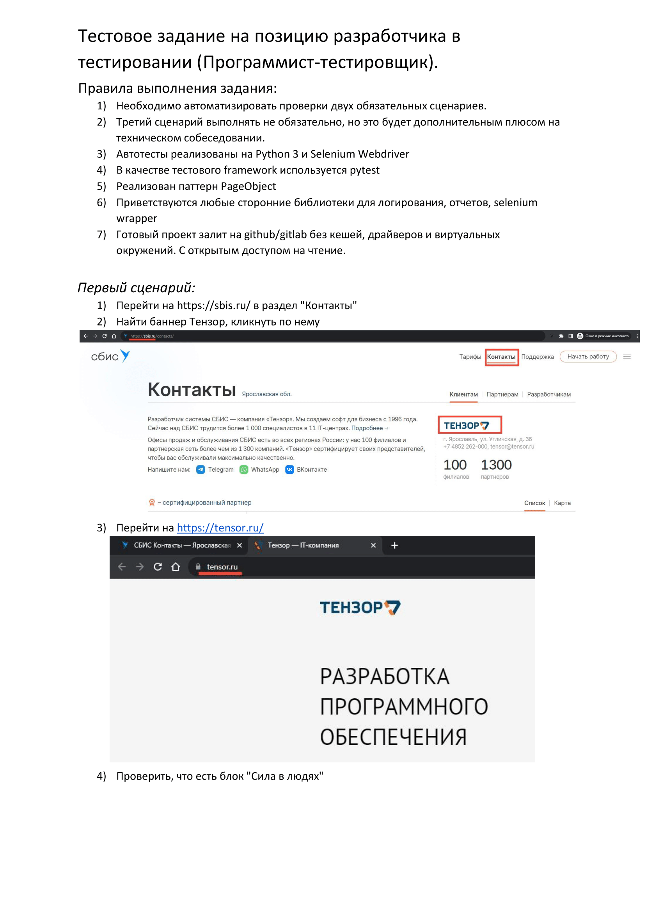
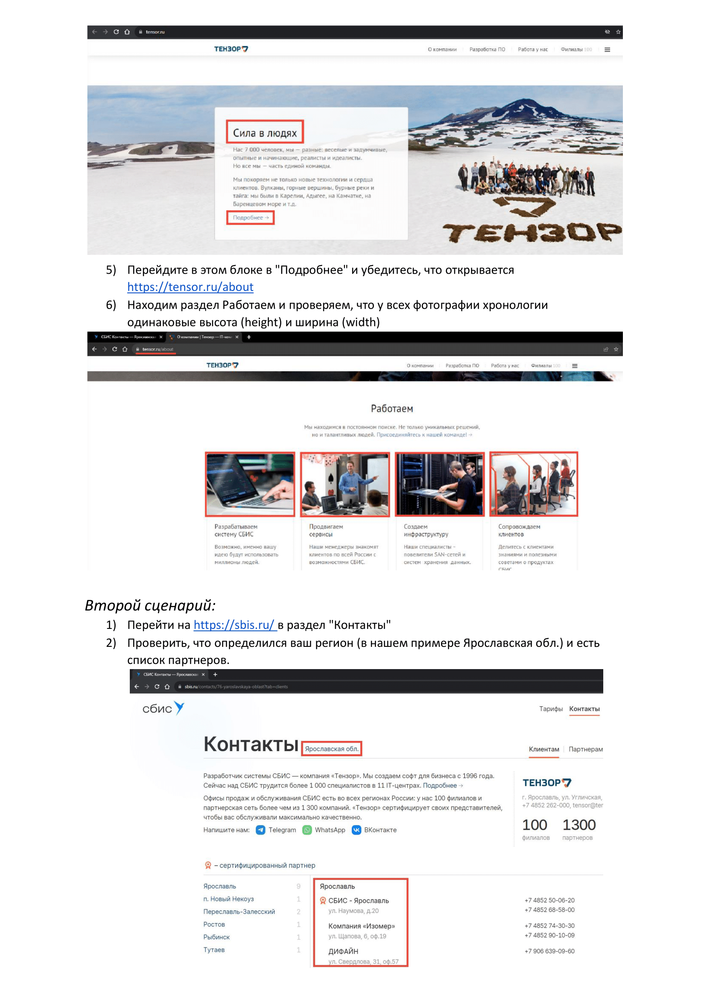

    ```markdown
# Тестовое задание от компании 'Тэнзор' на автотестирование






### Как установить

##### 1. Склонировать репозиторий

##### 2. _**Для прохождения теста проверки местоположения Вам нужно указать свой регион в файле .env!!!**_ <br>

   Замените город и область на свои (как они прописаны на сайте SBIS). <br>
   Сейчас установлены: <br>
   REGION=Нижегородская обл. <br>
   CITY=Нижний Новгород

##### 3. Создать виртуальное окружение

##### 4. Активировать виртуальное окружение

##### 5. Установить зависимости

##### 6. Запускаем тесты из корня директории командой 'pytest', 'pytest -s -v' - для подробной информаци


##### Контакты

Вы можете со мной связаться по email: [katerina.utg@gmail.com](mailto:katerina.utg@gmail.com)