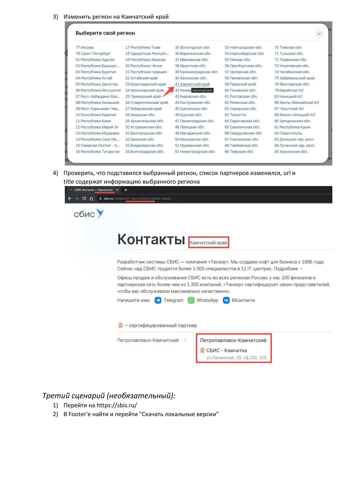
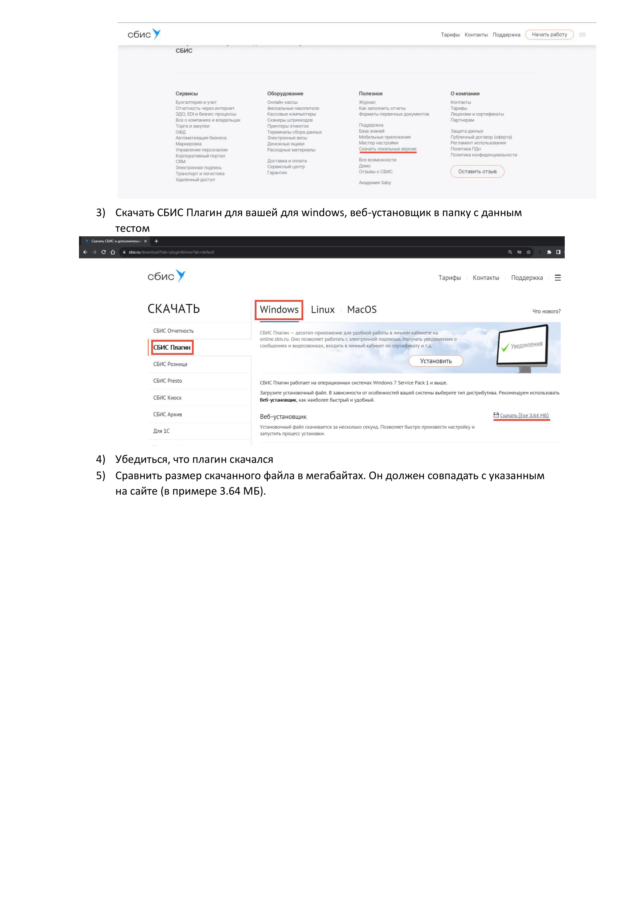

    ```markdown
# Тестовое задание от компании 'Тэнзор' на автотестирование







### Как установить

##### 1. Склонировать репозиторий

##### 2. Установить нужную версию ChromeDriver

   Установка драйвера для браузера: Windows <br>
   - Для установки откройте сайт https://googlechromelabs.github.io/chrome-for-testing/#stable и скачайте ту версию ChromeDriver, 
   которая соответствует версии вашего браузера. Чтобы узнать версию браузера, откройте новое окно в Chrome, 
   в поисковой строке наберите: chrome://version/ и нажмите Enter. В верхней строчке вы увидите информацию про версию браузера. <br>
   - Создайте на диске C: папку chromedriver и положите разархивированный ранее файл chromedriver.exe в папку C:\chromedriver. <br>
   - Добавьте в системную переменную PATH папку C:\chromedriver. Как это сделать в разных версиях Windows, описано здесь: https://www.computerhope.com/issues/ch000549.htm. <br>

##### 3. _**Для прохождения теста проверки местоположения Вам нужно указать свой регион в файле .env!!!**_ <br>

   Замените город и область на свои (как они прописаны на сайте SBIS). <br>
   Сейчас установлены: <br>
   REGION=Нижегородская обл. <br>
   CITY=Нижний Новгород

##### 4. Создать виртуальное окружение

##### 5. Активировать виртуальное окружение

##### 6. Установить зависимости

##### 7. Запускаем тесты из корня директории командой 'pytest', 'pytest -s -v' - для подробной информаци


##### Контакты

Вы можете со мной связаться по email: [katerina.utg@gmail.com](mailto:katerina.utg@gmail.com)